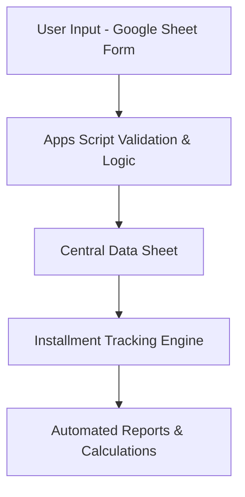

#  Automated Loan & Client Management System  
### Google Sheets + Apps Script–Based Workflow Automation

---

##  Project Overview

This project is an **automated client data input, loan tracking, and installment management system** developed using **Google Sheets, Google Apps Script, and JavaScript**.

The system was designed for the **Upazila Youth Development Office** to digitize and streamline manual loan-processing workflows, enabling accurate financial tracking, faster reporting, and reduced human error.

---

##  Problem Statement

Government loan programs often rely on:
- Manual data entry
- Paper-based records
- Disconnected spreadsheets
- Error-prone interest calculations

These limitations lead to:
- Delayed reporting
- Inconsistent loan records
- Difficulty tracking installments and overdue interest

This project addresses these challenges by introducing a **centralized, automated, and logic-driven spreadsheet system**.

---

##  System Architecture

---

##  Core Functionalities

### 1️⃣ Client Data Input Automation
- Structured form-based input inside Google Sheets
- Automated validation and formatting
- New client records appended programmatically

  

---

### 2️⃣ Loan & Installment Tracking
- Tracks:
  - Principal amounts
  - Interest payments
  - Savings deposits
- Automatically calculates:
  - Outstanding balances
  - Installment counts
  - Overdue interest

---

### 3️⃣ Dynamic Interest & Overdue Calculation
- Time-based interest calculation using transaction dates
- Automatically updates:
  - Accrued interest
  - Outstanding dues
- Eliminates manual computation errors

  

---

### 4️⃣ Search & Retrieval System
- Client search using unique identifiers
- Auto-populates:
  - Loan history
  - Payment status
  - Installment summaries

  

---

### 5️⃣ Installment Recording Engine
- Dynamically appends installment records
- Maintains chronological history
- Updates aggregate totals automatically

  

---

### 6️⃣ Automated Reporting
- Generates **personal loan reports** for individual clients
- Real-time snapshot of:
  - Loan status
  - Payment history
  - Current liabilities
  

  

---

##  Technical Highlights

- **Google Apps Script (JavaScript-based)**
- Custom functions for:
  - Date-based calculations
  - Installment indexing
  - Conditional logic execution
- Structured sheet-to-sheet data synchronization
- Form-driven workflow design

---

##  Technologies Used

| Category | Tools |
|--------|------|
| Spreadsheet Platform | Google Sheets |
| Automation | Google Apps Script |
| Programming | JavaScript |
| Data Management | Sheet-based relational structure |
| Reporting | Automated spreadsheet reports |

---

##  Data Privacy & Ethics

To protect sensitive financial information:
- The original Google Sheet is **not publicly shared**
- All documentation uses **anonymized logic descriptions**
- No real client data is exposed in this repository

This repository serves as **technical documentation and system explanation only**.

---

##  Limitations

- Google Sheets performance depends on dataset size
- Apps Script execution limits apply
- UI customization is limited compared to full web apps

---

##  Future Improvements

- Migration to a database-backed web application
- Role-based access control
- Audit logging
- API-based reporting
- Integration with national ID systems (subject to policy)

---

##  Academic & Practical Relevance

This project demonstrates:
- Real-world workflow automation
- Financial logic implementation
- Applied JavaScript in non-traditional environments
- Government-scale process optimization

It is suitable as:
- A case study for MIS / Public Administration
- A foundation for digital governance research
- An applied systems design portfolio project
